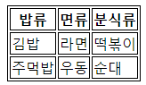

# Section5 : HTML: 폼과 테이블

### ( 예제: 5_HTMLForm)

## 테이블

table 태그는 데이터를 포함하는 셀(cell)들의 행과 열로 구성된 2차원 테이블을 정의할 때 사용한다.  
이러한 테이블은 table요소와 자식 요소인 하나 이상의 tr, th, td 요소들로 구성된다.  
tr요소는 테이블의 각 행(row)을 정의하고, th 요소는 각 열의 제목을 정의한다. td 요소는 하나의 테이블 셀(cell)을 정의한다.

```html
<body>
  <table>
    <Thead>
      <tr>
        <th>밥류</th>
        <th>면류</th>
        <th>분식류</th>
      </tr>
    </Thead>
    <Tbody>
      <tr>
        <td>김밥</td>
        <td>라면</td>
        <td>떡볶이</td>
      </tr>
      <tr>
        <td>주먹밥</td>
        <td>우동</td>
        <td>순대</td>
      </tr>
    </Tbody>
</body>
```

;

### Thead, Tbody, Tfoot 요소

- Thead : 머리글
- Tbody : 본몬글
- Tfoot : 바닥글

이 태그들은 table에서 머리, 본문, 바닥을 명시해주는 역할을 한다.  
table을 코딩할 때, 이 세개의 요소를 반드시 적어줘야 하는 것은 아니다.  
이 세개의 태그를 적어주는 경우는 '각 영역을 구분지어서 사용하고 싶을 때' 이다.

### Colspan & Rowspan

Col은 column의 약자이다. 행을 의미한다. 셀이 가로로 병합된다.  
Row는 열을 의미한다. 셀이 세로로 병합된다.

## 폼(form) 요소

폼은 사용자 의견이나 정보를 알기 위해 입력할 큰 틀을 만드는 데 사용된다. 폼은 입력된 데이터를 한 번에 서버로 전송한다. 전송한 데이터는 웹 서버가 처리하고, 결과에 따른 또 다른 웹 페이지를 보여준다.  
쉽게 말해 폼은 일종의 그룹화된 모든 입력을 담는 상자(컨테이너)이다. 입력 받은 데이터를 전송하는 역할을 한다.

### 폼 태그 동작방법

1. 폼이 있는 웹 페이지를 방문한다.
2. 폼 내용을 입력한다.
3. 폼 안에 있는 모든 데이터를 웹 서버로 보낸다.
4. 웹 서버는 받은 폼 데이터를 처리하기 위해 웹 프로그램으로 넘긴다.
5. 웹 프로그램은 폼 데이터를 처리한다.
6. 처리결과에 따른 새로운 html 페이지를 웹 서버에 보낸다.
7. 웹 서버는 받은 html 페이지를 브라우저에 보낸다.
8. 브라우저는 받은 html 페이지를 보여준다.

### 일반적인 입력 형식

- input : 매우 다양하게 활용된다. input을 활용하여 20개 이상의 다른 입력란을 만들 수 있다. type 이라는 속성 하나를 변경하는데 이 type이 작동 방식을 크게 바꾼다.
  - type : 입력 방식을 정해준다.
  - placeholder : 사용자가 입력하기 전에 보여지는 문구를 작성한다.  
    입력창에 입력값이 들어오면 placeholder 문구는 사라진다.
  - id : 한 개의 요소만 지정된 id를 가지고 있어야 한다. 다른 요소와 연결할 때 id값을 통해 서로 연결한다.

### 레이블 (label)

사용자 인터페이스 항목의 설명을 나타낸다.  
label을 input 요소와 연결하면 몇 가지 이점이 있다.

- label 텍스트는 텍스트 입력과 시각적으로 관련이 있을뿐만 아니라 프로그래밍적으로도 관련이 있다. 예를 들어, 화면리더기는 폼 입력에서 label을 읽어서 보조기술 사용자가 입력해야하는 텍스트가 무엇인지 더 쉽게 이해할 수 있게 한다.
- 관련 label을 클릭해서 input 자체에 초점을 맞추거나 활성화를 시킬 수 있다. 늘어난 누를 수 있는 영역(hit area)은 터치스크린 사용자를 포함해 입력하려하는 모든 사람에게 이점을 준다.

label을 input 요소와 연관시키려면, inputdp id 속성을 넣어야한다. 그런 다음 label에 id와 같은 값의 for 속성을 넣어야 한다.  
또는, label 안에 input 을 중첩시킬 수 있다. 이 경우 연관이 암시적이므로 for 및 id 속성이 필요없다.

### HTML 버튼

button 태그가 form 태그 안에 있으면 아무 속성을 주지 않아도 누르면 데이터를 전송한다. 하지만 type속성에 button을 주면 눌러도 데이터 전송을 하지 않는 button으로만 기능한다.  
form 태그 밖에 button을 만들면 type속성을 submit으로 하지 않는 한 아무 동작도 하지 않는 button이 된다.  
input type="submit" 도 버튼처럼 나오는데 레이아웃이 불편하기 때문에 좋은 방식은 아니다.

### name 속성

input 태그에 name 속성을 추가하면 name의 값을 통해 input을 참조할 수 있다.

### 유효성 검사

사용자가 입력 양식에 맞게 입력을 하였는지 검사 할 수 있다.  
양식과 다른 입력값이 들어오면 경고 문고를 표시할 수 있다.

```html
<!-- form.html -->
<!DOCTYPE html>
<html lang="ko">
  <head>
    <meta charset="UTF-8" />
    <meta name="viewport" content="width=device-width, initial-scale=1.0" />
    <title>Forms Demo</title>
  </head>
  <body>
    <h1>Forms Demo</h1>
    <button>OUTSIDE FORM!</button>

    <!-- action 속성으로 데이터를 보낼 곳을 지정한다. -->
    <form action="/tacos">
      <button type="button">PLEASE DO NOT SUBMIT THE FORM</button>
      <p>
        <label for="username">Enter a Username:</label>
        <input
          id="username"
          type="text"
          placeholder="username"
          name="username"
        />
      </p>
      <p>
        <label for="password">Enter a Password</label>
        <input id="password" type="password" placeholder="username" />
      </p>
      <button>IN THE MIDDLE!</button>
      <p>
        <label>
          Enter a Color:
          <input type="color" id="color" />
        </label>
      </p>
      <button>Submit</button>
    </form>
    <!-- google 검색 -->
    <form action="https://www.google.com/search">
      <input type="text" name="q" />
      <button>Search Reddit</button>
    </form>

    <h2>More Inputs!</h2>
    <form action="/birds">
      <input type="checkbox" name="agree_tos" id="agree" />
      <label for="agree">I agree to everything!</label>
      <p>
        <label for="xs">XS:</label>
        <input type="radio" name="size" id="xs" value="xs" />
        <label for="s">S:</label>
        <input type="radio" name="size" id="s" value="s" />
        <label for="m">M:</label>
        <input type="radio" name="size" id="m" value="m" />
      </p>
      <!-- name을 이용해 radio들을 하나로 묶을 수 있다. -->
      <!-- radio의 value는 제출했을 때 서버에 전송되는 값이다.-->
      <p>
        <label for="meal">Please Select an Entree</label>
        <select name="meal" id="meal">
          <option value="fish">Fish</option>
          <option value="veg">Vegetarian</option>
          <option value="steak">Steak</option>
      </p>
      <p>
        <label for="cheese">Amount of Cheese:</label>
        <input type="range" id="cheese" min="1" max="100" name="cheese_level" step="5" value="25">
      </p>
      <p>
        <label for="requrests">Any Special Requests?</label>
        <br/>
        <textarea id="requests" rows="10" cols="40" name="Requests?" placeholder="Type something here">
      </p>
      <button>Submit!</button>

      <h2>Validations Demo</h2>
      <form action="/dummy">
        <label for="first">Enter First Name</label>
        <input type="text" id="first" name="first" required>
        <p>
          <label for="username">Username</label>
          <input type="text" id="username" name="username" minlength="5" maxlength="20" required>
        </p>
        <button>Submit</button>
    </form>
  </body>
</html>
```
