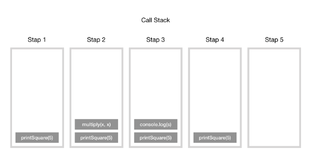

# Section27 : 비동기식 JavaScript

## 콜스택 (callstack)

콜스택은 프로그램이 함수 호출(Function call)을 추적할 때 사용하는 것이다. 콜 스택은 각function call 당 하나씩의 스택들로 이루어져 있다.  
함수를 실행하면 해당 함수의 기록을 스택 맨 위에 추가(Push)한다. 우리가 함수의 결과 값을 반환하면 스택에 쌓여있던 함수는 제거(Pop)된다.

```js
function multiply(x, y) {
  return x * y;
}
function printSquare(x) {
  vas s = multiply(x, y);
  console.log(s);
}
printSqurae(5);
```

엔진이 이 코드를 실행하기 전에는 호출 스택이 비어있다. 가장 아랫줄에 printSquare 함수가 실행되면 이후 단계는 다음과 같다.

;

콜스택을 시각화하여 확인할 수 있는 방법이 두 가지가 있다.

1. loupe : 함수를 작성하면 함수의 실행 순서를 보여주는 프로그램.
2. chrome 개발자 도구의 디버깅 기능

## webAPI와 단일 스레드

### 단일 스레드

프로세스는 운영체제로부터 자원을 할당받는 작업의 단위이고 스레드는 프로세스가 할당받은 자원을 이용하는 실행의 단위이다.  
단일 스레드란 하나의 프로세스에서 하나의 스레드를 실행하고, 하나의 레지스터와 스택으로 표현하는 것이다.

### 단일 스레드의 장점

- 자원 접근에 대한 동기화를 신경쓰지 않아도 된다.
  - 여러개의 스레드가 공유된 자원을 사용할 경우, 각 스레드가 원하는 결과를 얻게 하려면 공용 자원에 대한 접근이 통제되어야 하며, 이 작업은 프로그래머에게 많은 노력을 요구하고 많은 비용을 발생시킨다. 단일 스레드 모델에서는 이러한 작업이 필요하지 않다.
- 작업전환 작업을 요구하지 않는다.
  - 작업 전환은 여러 개의 프로세스가 하나의 프로세서를 공유할 때 발생하는 작업으로 많은 비용을 필요로 한다.

### 단일 스레드의 단점

- 여러 개의 CPU를 활용하지 못한다.
  - 프로세서를 최대한 활용하게 하려면 cluster 모듈을 사용하거나, 외부에서 여러 개의 프로그램 인스턴스를 샐행시키는 방법을 사용해야 한다.

## webAPI

### API

Application Programming Interface의 약자로 응용 프로그램에서 사용할 수 있도록, 운영체제나 프로그래밍 언어가 제공하는 기능을 제어할 수 있게 만드는 인터페이스를 뜻한다.  
주로 파일 제어, 창 제어, 화상 처리, 문자 제어 등 자신이 원하는 기능을 제어할 수 있도록 하는 인터페이스를 제공한다. 따라서 원하는 기능을 제어하는 API를 직접 만들 수도 있다.

### webAPI

웹 서버 또는 웹 브라우저를 위한 애플리케이션 프로그래밍 인터페이스이다. HTTP 서비스이고 다양한 클라이언트에서 접근이 가능하도록 설계되어 있다. Web환경을 통해 제공되는 데이터 CRUD 인터페이스를 제공한다.  
HTTP 표준 접근 방식을 이용하며 플랫폼 환경, 클라이언트 환경의 제한이 없는 서비스 구현이 가능하다.

setTimeout 같은 함수나 콜백함수는 webAPI 함수인데 함수가 호출된 후 실행될 때까지 브라우저(webAPI)로 넘긴다. 그 후 브라우저에서 시간이 지나 실행될 때가 되면 다시 넘겨받는다. 브라우저로 넘어간 사이에 자바스크립트는 다른 함수들을 실행한다.

## 콜백 지옥

콜백 함수의 중첩이 많아지면 계단식으로 코드가 튀어나오게 되고 보기 힘들고 지저분해져서 가독성도 떨어진다.

```js
setTimeout(() => {
  document.body.style.backgroundColor = "red";
  setTimeout(() => {
    document.body.style.backgroundColor = "orange";
    setTimeout(() => {
      document.body.style.backgroundColor = "yellow";
      setTimeout(() => {
        document.body.style.backgroundColor = "green";
      }, 1000);
    }, 1000);
  }, 1000);
}, 1000);
```

## Promise

어떤 연산, 비동기 연산이 최종적으로 완료 혹은 성공했는지 실패했는지를 알려주는 객체이다.

```js
// Promise가 나오기 전에 쓰던 비동기 연산 함수 예제
// 콜백지옥이 펼쳐진다.
const fakeRequestCallback = (url, success, failure) => {
  const delay = Math.floor(Math.random() * 4500) + 500;
  setTimeout(() => {
    if (delay > 4000) {
      failure("Connection Timeout :(");
    } else {
      success(`Here is your fake data from ${url}`);
    }
  }, delay);
};

// Promise를 이용한 비동기 연산 함수 예제
const fakeRequestPromise = (url) => {
  return new Promise((resolve, reject) => {
    const delay = Math.floor(Math.random() * 4500) + 500;
    setTimeout(() => {
      if (delay > 4000) {
        reject("Connection Timeout:(");
      } else {
        resolve(`Here is your fake data from ${url}`);
      }
    }, delay);
  });
};
```

then 키워드와 catch 키워드가 있다.

- fakeRequestPromise(url).then()은 url요청이 성공했을 경우 실행되는 함수이다. () 안에 성공했을 경우 호출할 콜백함수를 넣으면 된다.
- fakeRequestPromise(url).catch()는 url요청이 실패했을 경우 실행되는 함수이다. () 안에 실패했을 경우 호출할 콜백함수를 넣으면 된다.
- fakeRequestPromise(url).then().catch() 이런식으로 작성하고 url호출 성공 여부에 따라 다음에 실행될 함수가 결정된다.

## Promise의 마법

Promise .then 메서드 안에서 Promise를 반환할 수 있다. 이 경우 catch문은 한번만 사용하면 된다. 코드가 훨씬 깔끔해진다.

```js
fakeRequestPromise("yelp.com/api/coffee/page1")
  .then((data) => {
    console.log("IT WORKED!!! (page1)");
    console.log(data);
    return fakeRequestPromise("yelp.com/api/coffee/page2");
  })
  .then((data) => {
    console.log("IT WORKED!!! (page2)");
    console.log(data);
  })
  .catch((err) => {
    console.log("OH NO, A REQUEST FAILED!!!");
    console.log(err);
  });
```

## 나만의 Promise 만들기

1초마다 색이 바뀌는 함수이다. Promise를 반환하면서 콜백지옥을 벗어날 수 있다.

```js
const delayedColorChange = (color, delay) => {
  return new Promise((resolve, reject) => {
    setTimeout(() => {
      document.body.style.backgroundColor = color;
      resolve();
    }, delay);
  });
};

delayedColorChange("red", 1000)
  .then(() => delayedColorChange("orange", 1000))
  .then(() => delayedColorChange("yellow", 1000))
  .then(() => delayedColorChange("green", 1000))
  .then(() => delayedColorChange("blue", 1000))
  .then(() => delayedColorChange("indigo", 1000))
  .then(() => delayedColorChange("violet", 1000));
```

## 비동기 키워드

### async

async 는 함수를 비동기 함수로 선언하는 키워드이다.  
함수 앞에 async를 입력해서 함수를 비동기 함수로 선언하면 자동으로 Promise를 반환한다.

```js
// 로그인을 수행하는 건 시간이 걸리는 작업이다. 어딘가에 있는 서버에 접속해야 하기 때문이다. 즉각적인 반응은 아니다.
// 그래서 비동기 함수를 사용한다.
const login = async (username, password) => {
  if (!username || !password) throw "Missing Credentials";
  if (password === "corgifeetarecute") return "WELCOME!";
  throw "Invalid Password";
};

login("aklsdjf", "sdkfj")
  .then((msg) => {
    console.log("LOGGED IN!");
    console.log(msg);
  })
  .catch((err) => {
    console.log("ERROR!!");
    console.log(err);
  });
```

### await

await는 기다리게 하는 키워드이다.  
Promise가 값을 반환할 때까지 기다리기 위해 비동기 함수의 실행을 일시 정지시킨다. 비동기 함수에서만 적용하기 때문에 async와 await가 한 쌍이다.

```js
const delayedColorChange = (color, delay) => {
  return new Promise((resolve, reject) => {
    setTimeout(() => {
      document.body.style.backgroundColor = color;
      resolve();
    }, delay);
  });
};

async function rainbow() {
  await delayedColorChange("red", 1000);
  await delayedColorChange("orange", 1000);
  await delayedColorChange("yellow", 1000);
  await delayedColorChange("green", 1000);
  await delayedColorChange("blue", 1000);
  await delayedColorChange("indigo", 1000);
  await delayedColorChange("violet", 1000);
  return "ALL DONE!";
}

rainbow().then(() => console.log("END OF RAINBOW!"));
```

## 비동기 함수의 오류 처리하기

오류 처리를 할 땐 try, catch 키워드를 사용한다.  
오류가 날 발생할 것 같거나 발생하는 부분을 try{} 로 감싸고 catch{}문에서 오류가 발생했을 경우 실행할 코드를 작성해주면 된다.

```js
// 난수를 생성해서 4000보다 작으면 에러를 생성하는 fakeRequest함수를 try문으로 감쌌다.
async function makeTwoRequests() {
  try {
    let data1 = await fakeRequest("/page1");
    console.log(data1);
    let data2 = await fakeRequest("/page2");
    console.log(data2);
  } catch (e) {
    console.log("CAUGHT AN ERROR!");
    console.log("error is:", e);
  }
}
```
