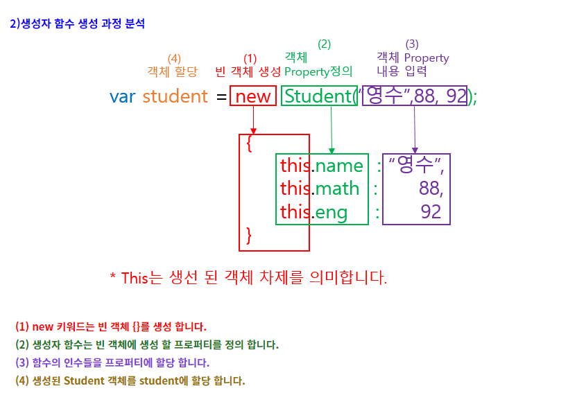

# Section29 : 프로토타입, 클래스, 그리고 OOP

## 프로토타입

JavaScript에서는 객체를 상속하기 위하여 프로토타입이라는 방식을 사용한다.  
JavaScript는 흔히 프로토타입 기반 언어(prototype-based language)라고 불린다. 모든 객체들이 메소드와 속성을 상속 받기 위한 템플릿으로써 프로토타입 객체(prototype object)를 가진다는 의미이다. 프로토타입 객체도 또 다시 상위 프로토타입 객체로부터 메소드와 속성을 상속 받을 수도 있고 그 상위 프로토타입 객체도 마찬가지이다. 이를 프로토타입 체인(prototype chain)이라 부르며 다른 객체에 정의된 메소드와 속성을 한 객체에서 사용할 수 있도록 하는 근간이다.

정확히 말하자면 상속되는 속성과 메소드들은 각 객체가 아니라 객체의 생성자의 prototype 이라는 속성에 정의되어 있다.

JavaScript에서는 객체 인스턴스와 프로토타입 간에 연결(많은 브라우저들이 생성자의 prototype 속성에서 파생된 \_\_proto\_\_ 속성으로 객체 인스턴스에 구현하고 있다.) 이 구성되며 이 연결을 따라 프로토타입 체인을 타고 올라가며 속성과 메소드를 탐색한다.

> Note : 객체의 prototype(Object.getPrototypeOf(obj) 함수 또는 deprecated된 \_\_proto\_\_ 속성으로 접근 가능한)과 생성자의 prototype 속성의 차이를 인지하는 것이 중요하다. 전자는 개별 객체의 속성이며 후자는 생성자의 속성이다. 이 말은 Object.getPrototypeOf(new Foobar())의 반환값이 Foobar.prototype과 동일한 객체라는 의미이다.

## 객체 지향 프로그래밍 개요 (Object Oriented Programming)

객체지향 프로그래밍은 프로그램 설계 방법론의 일종이다.  
프로그래밍 할 때 프로그램을 단순히 데이터와 처리 방법으로 나누는 것이 아닌 객체라는 단위로 나누고 이를 서로 상호작용할 수 있게 만들어 역할을 수행 할 수 있게 만든다.  
그래서 이를 사용하기 위해 다른 언어에서는 Class 라는 문법을 제공하고 있는데 물론 Class가 없다고 객체가 아닌 것은 아니다.  
JavaScript에서는 Prototype 을 사용하여 객체를 표현한다.

### 객체 지향 프로그래밍의 4가지 특징

1. 캡슐화 (Encapsulation)

- 변수와 함수를 하나로 묶고 필요에 따라 접근 권한을 나누어 외부에서 함부로 접근하지 못하게 제한을 두어 객체의 손상을 방지한다.  
  이에 따라 내부 구현 내용을 감추어 외부에서 확인 할 수 없도록 정보 은닉도 포함하게 된다.

2. 추상화 (Abstraction)

- 객체들이 사용하는 공통적인 변수와 함수들을 따로 묶는 것을 말한다.  
  예를 들어, 말, 강아지, 고양이가 존재한다고 치면 이 3가지의 동물들이 공통적으로 수행하는 행동 중 숨쉬기, 걷기, 달리기 등등이 있을 것이고, 다리 갯수, 성별 등 공통적으로 가지고 있는 특징들도 있다.  
  이렇게 공통적인 행동과 특징들을 가지고 하나의 객체를 정의하는 과정을 추상화로 볼 수 있다.

3. 상속 (Inheritance)

- 자식 객체가 부모 객체의 변수와 함수를 그대로 물려 받을 수 있는 것을 뜻한다.  
  예를 들어, 동물이라는 객체에 달리기, 숨쉬기 함수가 있다면 강아지, 고양이 객체를 만들 때 동물 객체를 상속 받아 강아지, 고양이 객체에서는 달리기, 숨쉬기 함수를 따로 구현하지 않고 동물 객체의 달리기, 숨쉬기 함수를 쓸 수 있다.

4. 다형성 (Polymorphism)

- 같은 객체임에도 상황에 따라 다르게 동작할 수 있는 것을 뜻한다.  
  오버로딩 (Overloading) 이나 오버라이딩 (Overriding) 같은 것을 사용하여 객체를 상황에 따라 다르게 사용할 수 있다.

- 오버로딩 (Overloading)
  - 같은 이름의 함수명을 가지면서 매개 변수의 유형과 개수를 다르게 만들어 쓸 수 있다. (JavaScript에서는 변수 타입이 자유롭기 때문에 사실상 없는 개념)
- 오버라이딩 (Overriding)
  - 부모 객체가 가지고 있는 함수를 자식 객체가 해당 함수를 재정의해서 사용할 수 있다.

## 팩토리 함수

객체를 반환하는 함수를 팩토리 함수라고 부른다.

```js
// 팩토리 함수 에제
function makeColor(r, g, b) {
  const color = {};
  color.r = r;
  color.g = g;
  color.b = b;
  color.rgb = function () {
    const { r, g, b } = this;
    return `rgb(${r}, ${g}, ${b})`;
  };
  color.hex = function () {
    return "#" + ((1 << 24) + (r << 16) + (g << 8) + b).toString(16).slice(1);
  }; // rgb 색상을 16진법으로 바꿔 주는 코드
  return color;
}
// 비어 있는 상태로 시작하지만 주어진 인수를 기반으로 속성을 추가하고, 몇 가지 메서드를 추가해서 객체를 반환한다.

const firstColor = makeColor(35, 255, 150);
firstColor.hex();
```

## 생성자 함수

자바스크립트 함수는 재사용 가능한 코드를 묶음으로 사용하는 것 외에 객체를 생성 하기 위한 방법으로도 사용된다.  
객체를 생성하기 위해서는 직접 객체를 반환해도 되지만, new 키워드를 사용하여 함수를 호출하게되면 return 문이 없어도 새로운 객체를 반환시킬 수 있다.  
그리고 함수에서 this를 사용하여 반환되는 객체의 초기 상태와 행위를 정의할 수 있다.  
이렇게 객체를 생성하는 역할을 하는 함수를 생성자 함수라고 한다.

- 생성자 함수는 new 키워드를 사용하지 않으면 일반적인 함수와 동일하게 동작하여 새로운 객체를 반환하지 않는다.

그렇기 때문에 함수명을 대문자로 시작한다.

- 객체에 타입이 적용되면 해당 객체는 그 타입의 인스턴스라고 부른다.  
  그래서 new 키워드로 만들어진 객체는 해당 타입의 instance라고 칭한다.



```js
// 생성자 함수 예제
function Color(r, g, b) {
  this.r = r;
  this.g = g;
  this.b = b;
  console.log(this);
} // 이 경우엔 this가 전역 객체인 window를 가리킨다.

new Color(255, 40, 100);
// 새로운 객체를 생성해서 이 this를 그 새 객체에 설정하니까 여기선 새 객체에 r, g, b를 추가한다.
// 그리고 마지막엔 this를 반환한다.
// new 키워드를 사용하지 않으면 this는 window를 가리킨다.

// 팩토리 함수 예제의 경우엔 const color = {} 를 this가 참조하고 마지막에 color를 반환한다.
```

### 팩토리 함수 vs 생성자 함수

팩토리 함수와 생성자 함수는 모두 객체를 반환한다는 점에서 크게 차이가 없는 것처럼 보일 수 있다. 하지만 각 객체의 \_\_proto** 를 자세히 살펴보면 차이점을 발견할 수 있다.  
팩토리 함수의 \_\_proto** 는 Object.prototype을 가리키는 반면,  
생성자 함수의 \_\_proto\_\_ 는 히당 함수의 prototype을 가리킨다.  
이러한 차이을 이해하기 위해서 new 키워드를 통한 객체 생성 과정을 알아야 한다.

### 생성자 함수의 객체 생성 과정

```js
function Person(name, age, gender) {
  // 1. this = {}; 빈 객체를 만든다.
  // 2. this.__proto__ = Person.prototype; 생성자 함수의 prototype 대입.

  // 3. this에 프로퍼티를 추가한다.
  this.name = name;
  this.age = age;
  this.gender = gender;
  // 4. return this
}

const person = new Person("kate", 27, "W");
```

즉, 생성자 함수를 new 키워드로 호출함으로써 Person() 함수 내부적으로는 this라는 빈 객체가 생성되고, 이때 this는 생성자 함수의 prototype을 \_\_proto\_\_로 받기 때문에 사용자가 정의한 객체를 더 쉽고 간단하게 만들 수 있도록 도와준다.

## JavaScript의 클래스

Class는 객체를 생성하기 위한 템플릿이다. 클래스는 데이터와 이를 조작하는 코드를 하나로 추상화한다. 자바스크립트에서 클래스는 프로토타입을 이용해서 만들어졌지만 ES5의 클래스 의미와는 다른 문법과 의미를 가진다.  
Class는 사실 "특별한 함수"이다. 함수처럼 class표현식 과 class선언 두 가지 방법을 제공한다.

### Class 선언

Class를 정의하는 한 가지 방법은 class 선언을 이용하는 것이다. class를 선언하기 위해서는 클래스의 이름(여기서 "Rectangle")과 함께 class 키워드를 사용해야 한다.

```js
class Rectangle {
  constructor(height, weith) {
    this.height = height;
    this.width = width;
  }
}
```

### Hoisting

함수 선언과 클래스 선언의 중요한 차이점은 함수의 경우 정의하기 전에 호출할 수 있지만, 클래스는 반드시 정의한 뒤에 사용할 수 있다는 점이다.

```js
const p = new Rectangle(); // ReferenceError

class Rectangle {}
```

### Class 표현식

Class 표현식은 class를 정의하는 또 다른 방법이다. Class 표현식은 이름을 가질 수도 있고, 갖지 않을 수도 있다. 이름을 가진 class 표현식의 이름은 클래스 body의 local scope에 한해 유효하다.(하지만, 클래스의(인스턴스 이름이 아닌) name 속성을 통해 찾을 수 있다.)

```js
//unnamed
let Rectangle = class {
  constructor(height, width) {
    this.height = height;
    this.width = width;
  }
};
console.log(Rectangle.name);
// 출력 : "Rectangle"

// named
let Rectangle = class Rectangle2 {
  constructor(height, width) {
    this.height = height;
    this.width = width;
  }
};
console.log(Rectangle.name);
// 출력 : "Rectangle2"
```

### Class body와 메서드 정의

Class body는 중괄호 {} 로 묶여 있는 안쪽 부분이다. 이곳은 메서드나 constructor와 같은 class 멤버를 정의할 곳이다.

### Constructor (생성자)

constructor 메서드는 class 로 생성된 객체를 생성하고 초기화하기 위한 특수한 메서드이다. "constructor" 라는 이름을 가진 특수한 메서드는 클래스 안에 한 개만 존재할 수 있다. 만약 클래스에 여러 개의 constructor 메서드가 존재하면 SyntaxError가 발생할 것이다.

## extends, super 키워드

- extends 키워드는 클래스 선언이나 클래스 표현식에서 다른 클래스의 자식 클래스를 생성하기 위해 사용된다.
  - ex. class Cat extends Pet 은 클래스 Cat이 부모클래스인 Pet을 상속받는다는 뜻이다.
- super 키워드는 객체의 부모가 가지고 있는 메서드를 호출하기 위해 사용된다. 이는 프로토타입 기반 상속보다 좋은 점 중 하나이다.
  - ex. 아래 예제에서 Cat은 super키워드를 사용해 부모의 name,age 속성을 호출했다. 그리고 새로운 특성인 livesLeft 를 생성했다.

```js
class Pet {
  constructor(name, age) {
    this.name = name;
    this.age = age;
  }
  eat() {
    return `${this.name} is eating!`;
  }
}

class Cat extends Pet {
  constructor(name, age, livesLeft = 9) {
    super(name, age);
    this.livesLeft = livesLeft;
  } // 새로운 특성을 추가하고 싶을 때 super 키워드를 이용해 부모 class의 속성을 받아오고, 추가할 특성을 작성한다.
  meow() {
    return "MEOWWWW!!";
  }
}

class Dog extends Pet {
  bark() {
    return "WOOOF!!";
  }
  eat() {
    return `${this.name} scarfs his food!`;
  } // Pet에도 eat 메서드가 있지만 Dog에서 재선언 하고 Dog.eat을 호출하면 Dog 클래스의 eat() 이 호출된다.
}
```
