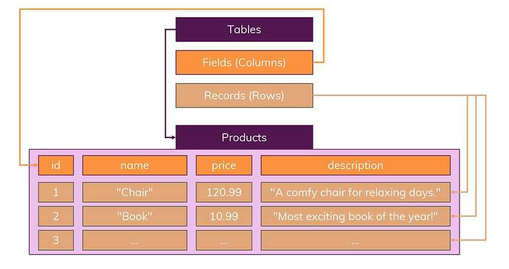
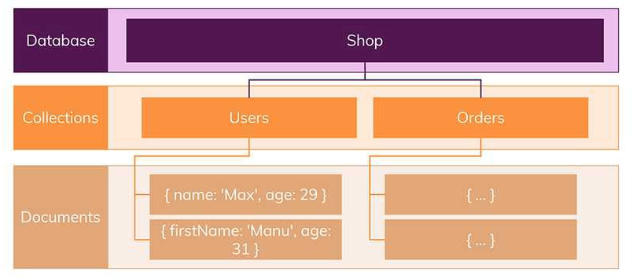
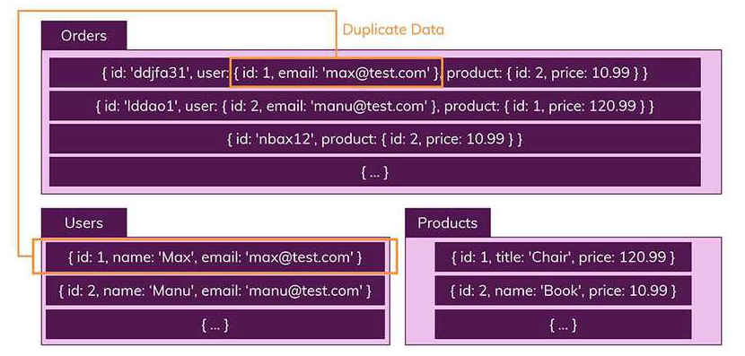

# Section36: 우리의 첫 번째 데이터베이스: MongoDB

## 데이터베이스(DataBase)의 개요

여러 사람에 의해 공유되어 사용될 목적으로 통합하여 관리되는 데이터의 집합을 말한다. 자료항목의 중복을 없애고 자료를 구조화하여 저장함으로써 자료 검색과 갱신의 효율을 높인다. 즉, 몇 개의 자료 파일을 조직적으로 통합하여 자료 항목의 중복을 없애고 자료를 구조화하여 기억시켜 놓은 자료의 집합체라고 할 수 있다.

## SQL과 NoSQL

### SQL (관계형 데이터베이스)

SQL은 '구조화 된 쿼리 언어 (Structured Query Language)'의 약자이다. 그러므로 데이터베이스 자체를 나타내는 것이 아니라, 특정 유형의 데이터베이스와 상호 작용하는 데 사용하는 쿼리 언어이다.  
SQL을 사용하면 관계형 데이터베이스 관리 시스템(RDBMS)에 데이터를 저장, 수정, 삭제 및 검색할 수 있다.  
이러한 관계형 데이테베이스에는 두 가지 주요 특징이 있다.

- 데이터는 정해진(엄격한) 데이터 스키마 (=structure)를 따라 데이터베이스 테이블에 저장된다.
- 데이터는 관계를 통해서 연결된 여러개의 테이블에 분산된다.

### 엄격한 스키마

데이터는 테이블(table)에 레코드(record)로 저장되며, 각 테이블에는 명확하게 정의된 구조(structure)가 있다. (구조란 어떤 데이터가 테이블에 들어가고 어떤 데이터가 그렇지 않을지를 정의하는 필드(field)집합을 가리킨다.)  
구조(structure)는 필드의 이름과 데이터 유형으로 정의된다.

### 관계

SQL 기반의 데이터 베이스의 또 다른 중요한 부분은 관계이다.  
데이터들을 여러개의 테이블에 나누어서, 데이터들의 중복을 피할 수 있다. 만약 사용자가 구입한 상품들을 나타내기 위해서는 User(사용자), Products(상품), Orders(주문한 상품) 여러 테이블을 만들어야 하지만, 각각의 테이블들은 다른 테이블에 저장되지 않은 데이터만을 가지고 있다. (중복된 데이터가 없다.)

이런 명확한 구조는 장점이 있다. 하나의 테이블에서 중복없이 하나의 데이터만을 관리하기 때문에, 다른 테이블에서 부정확한 데이터를 다룰 위험이 없다.

### NoSQL (비관계형 데이터베이스)

NoSQL은 기본적으로 SQL(관계형 데이터베이스)와 반대되는 접근방식을 따르기 때문에 지어진 이름이다.

- 스키마 없음
- 관계 없음

NoSQL에서는 레코드를 문서(documents)라고 부른다.  
이것은 단순히 이름만 다른 것이 아니라, 핵심적인 차이점이 있다. SQL은 정해진 스키마를 따르지 않는다면 데이터를 추가할 수 없지만, NoSQL은 다른 구조의 데이터를 같은 컬렉션(SQL의 테이블)에 추가할 수 있다.

문서는 JSON 데이터와 비슷한 형태를 가지고 있다. 그리고 스키마에 대해서는 신경쓸 필요가 없다.  
또한 일반적으로 관련 데이터를 동일한 컬렉션이 넣는다. 따라서 많은 Order이 있는 경우, 일반적인 정보를 모두 포함한 데이터를 Orders컬렉션에 저장한다.  
따라서 여러 테이블/콜렉션에 조인(join)할 필요없이 이미 필요한 모든 것을 갖춘 문서를 작성하게 된다.  
실제로 NoSQL 데이터베이스는 조인이라는 개념이 존재하지 않는다.  
대신 컬렉션을 통해 데이터를 복제하여 각 컬렉션 일부분에 속하는 데이터를 정확하게 산출하도록 한다.

이런 방식은 데이터가 중복되기 때문에 불안정한 측면이 있다. 실수로 컬렉션 B에서는 수정하지 않았는데, 컬렉션 A에서만 데이터를 업데이트 할 위험이 있다.  
특정 데이터를 같이 사용하는 모든 컬렉션에서, 똑같은 데이터 업데이트를 수행되도록 해야 한다. 그럼에도 불구하고, 이러한 방식의 큰 장점은 복잡하고 (어떤 순간에는 느린) 조인을 사용할 필요가 없다는 것이다. 필요한 모든 데이터가 이미 하나의 컬렉션 안에 저장되어 있기 때문이다.  
특히 자주 변경되지 않는 데이터 일때 더 큰 장점이 있다.

### 수직적(vertical) & 수평적(Horizontal) 확장(Scaling)

두 종류의 데이터베이스를 비교 할 때 살펴 봐야할 또 하나의 중요한 개념은 확장(Scaling)이다.

- 수직적 확장이란 단순히 데이터베이스 서버의 성능을 향상시키는 것이다.
- 수평적 확장은 더 많은 서버가 추가되고 데이터베이스가 전체적으로 분산됨을 의미한다. 따라서 하나의 데이터베이스에서 작동하지만 여러 호스트에서 작동한다.

데이터가 저장되는 방식 때문에 SQL 데이터베이스는 일반적으로 수직적 확장만을 지원한다. 수평적 확장은 NoSQL 데이터베이스에서만 지원한다.  
SQL데이터베이스는 '샤딩(Sharding)'의 개념을 알고 있지만 특정 제한이 있으며 구현하기가 대체로 어렵다. NoSQL 데이터베이스는 이를 기본적으로 지원하므로 여러 서버에서 데이터베이스를 쉽게 분리 할 수 있다.

### SQL과 NoSQL의 차이점

| SQL                                                                                                                                                       | NoSQL                                                                                                                               |
| :-------------------------------------------------------------------------------------------------------------------------------------------------------- | :---------------------------------------------------------------------------------------------------------------------------------- |
| SQL데이터베이스는 수직 확장이 가능하다. 단일 서버에서 하드웨어 용량 (CPU, RAM, SSD 등)을 늘려 확장 할 수 있다.                                            | NoSQL 데이터베이스는 수평 확장이 가능하다. 대규모로도를 관리하고 힙을 줄이기 위해 인프라에 더 많은 서버를 추가하여 확장 할 수 있다. |
| SQL 데이터베이스는 주로 관계형 데이터베이스(RDBMS)이다.                                                                                                   | NoSQL 데이터베이스는 주로 비 관계형 또는 분산 데이터베이승이다.                                                                     |
| 오래된 기술.                                                                                                                                              | 비교적 젊은 기술                                                                                                                    |
| SQL 데이터베이스는 행 및 열 형식의 테이블 기반이며 표준 스키마 정의를 엄격하게 준수해야 한다. 다중 행 트랜잭션이 필요한 응용 프로그램에 더 나은 옵션이다. | NoSQL 데이터베이스는 문서, 키-값 쌍, 그래프 또는 열을 기반으로 할 수 있으며 표준 스키마 정의를 고수 할 필요가 없다.                 |
| 구조화된 데이터를 위해 잘 설계되어 사전 정의 된 스키마가 있다.                                                                                            | 구조화되지 않은 데이터에 대한 동적 스키마가 있다. 데이터는 미리 정의 된 구조없이 유연하게 저장할 수 있다.                           |
| SQL 데이터베이스는 정규화 된 스키마를 선호한다.                                                                                                           | NoSQL 데이터베이스는 비정규화 된 스키마를 선호한다.                                                                                 |
| 확장 비용이 많이 든다.                                                                                                                                    | 관계형 데이터베이스에 비해 비용이 저렴하다.                                                                                         |
| SQL에는 쿼리 처리를 위한 표준 인터페이스가 있으므로 복잡한 쿼리에 적합하다.                                                                               | NoSQL에는 처리 쿼리를 위한 표준 인터페이스가 없기 때문에 복잡한 쿼리에는 적합하지 않다.                                             |
| SQL 데이터베이스는 계층 적 데이터 저장소에 적합하지 않다.                                                                                                 | NoSQL 데이터베이스는 데이터저장을 위한 키-값 쌍 방법을 따르므로 계층 적 데이터 저장에 가장 적합하다.                                |
| 성업적 관점에서 SQL 데이터베이스는 일반적으로 오픈 소스 또는 폐쇄 소스로 분류된다.                                                                        | 키-값 저장소, 문서 저장소, 그래프 저장소, 열 저장소 및 XML 저장소로 데이터를 저장하는 방식에 따라 분류된다.                         |
| SQL 데이터베이스는 ACID 속성 (원자성, 일관성, 격리 및 내구성)을 올바르게 따른다.                                                                          | NoSQL 데이터베이스는 Brewers CAP정리 (일관성, 가용성 및 파티션 허용 오차)를 올바르게 따른다.                                        |
| SQL 데이터베이스에 새 데이터를 추가하려면 데이터 백필, 스키마 변경과 같은 일부 변경이 필요하다.                                                           | 새 데이터는 이전 단계가 필요하지 않으므로 NoSQL 데이터베이스에 쉽게 삽입 할 수 있다.                                                |
| 모든 SQL 데이터베이스에 대해 우수한 공급 업체 지원 및 커뮤니티 지원이 제공된다.                                                                           | NoSQL 데이터베이스에는 제한된 커뮤니티 지원만 사용할 수 있다.                                                                       |
| 높은 트랜잭션 기반 애플리케이션에 가장 적합하다.                                                                                                          | 무거운 트랜잭션 목적으로 NoSQL을 사용할 수 있다.                                                                                    |
| 계층 적 데이터 저장에는 적합하지 않다.                                                                                                                    | 계층 적 데이터 저장 및 대용량 데이터 세트 (예 : 빅데이터) 저장에 적합하다.                                                          |
| SQL 데이터베이스의 예 : MySQL, Oracle, MS-SQL, SQLite                                                                                                     | NoSQL 데이터베이스의 예 : MongoDB, Apache CouchDB, Redis, HBase                                                                     |

## MongoDB

저장하는 데이터 형식은 BSON이다. 이진법JSON인데 좀 더 압축된 버전이다.

### mongo shell

MongoDB를 설치하면 mongo shell을 터미널에서 사용할 수 있다. Node REPL 과 같이 명령어로 조작할 수 있다. mongo shell은 자바스크립트 문법을 사용할 수 있다.

- command + k : clear기능
- use 데이터베이스 이름 : 앱에 쓸 데이터를 저장할 공간을 만든다.
  - use animalShelter : animalShelter라는 저장 공간을 만든다.

### MongoDB에 삽입하기

아직 존재하지 않는 집합에 무언가를 삽입하면 집합이 만들어진다.  
삽입을 위해 살펴볼 세 가지 메서드가 있다.

- insertOne() : 집합에 작성될 한 가지 혹은 하나의 객체만을 전달한다.

  - db.dogs.insertOne({name: "Charlie", age: 3, breed: "corgi", catFriendly: true})
  - 강아지 집합에 삽입한 객체이다.
  - dogs라는 집합이 없어도 위의 명령어를 입력하면 dogs라는 집합이 생긴다.  
    show collections 를 입력하면 dogs라는 집합을 확인할 수 있고,  
    db.dogs.find() 명령어를 입력하면 dogs 안에 들어있는 객체를 확인할 수 있다.
  - "\_id": ... 라는 특성이 추가되는데 이는 Mongo에서 자동으로 설정해주는 기본 키이다. 이 집합에서 모든 요소에 대해 고유해야 한다. 수동으로 설정할 수도 있고, 설정하지 않았을 경우에 Mongo가 자동으로 설정해준다.

- insertMany() : 다수의 값을 삽입할 수 있게 해준다.

- insert() : 하나의 문서나 객체를 전달할 수도 있고, 다수의 문서를 전달할 수도 있다.
  - 두가지 객체를 넣은 경우 : db.dogs.insert([{name: "Wyatt", breed: "Golden", age: 14, catFriendly: false}, {name: "Tonya", breed: "Chihuahua", age: 17, catFriendly: true}])
  - 한가지 객체를 넣은 경우 : db.cats.insert({name: "Blue Steele", age: 6, dogFriendly: false, breed: "Scottish fold"})

dogs와 cats는 별개의 집합이지만 같은 animalShelter라는 데이테베이스 안에 있다. 이 데이터베이스에서 나가려면 use local 명령어를 사용해서 local로 전환한다. 이 곳에선 dogs와 cats를 찾을 수 없다. 다시 use animalShelter 명령어를 사용하면 animalShelter 데이터베이스로 이동하고 dogs와 cats 집합을 찾을 수 있다.

### MongoDB에서 찾기

- db.dogs.find({breed: "corgi"})
  - db의 dogs 집합에서 breed가 corgi인 객체를 찾는다. 대소문자를 구분해야 한다.
- db.dogs.find({catFriendly: true})
  - db의 dogs 집합에서 catFriendly가 true 인 객체를 찾는다.
- findOne() : 여러개가 아닌 하나의 결과를 찾는다.
  - find() 는 cursor를 반환하고, findOne() 은 실제 문서를 반환한다.  
    커서는 마치 포인터 또는 결과의 참조라고 할 수 있다. 결과를 즉시 얻는 것과는 다르다.
- 객체를 찾을 때는 여러가지 특성으로 찾을 수도 있고(({catfriendly: true, age 17})), 조건을 넣어서(age>0) 찾을 수도 있다.

### MongoDB 업데이트 하기

업데이트 할 때는 일단 업데이트 할 것을 찾고, 업데이트 하는 방법을 지정해줘야 한다.

- updateOne() : 매치되는 첫 항목만 업데이트한다.

  - 두 가지의 인수를 입력한다. 첫 번째는 선택자이다. 두 번째는 수정사항이다.
  - db.dogs.updateOne({name: 'Charlie'}, {$set: {age: 4}})
  - dogs 집합의 name이 Charlie인 객체를 선택해서 age를 4로 바꾼다.  
    수정사항을 입력할 땐 {$set: {수정사항}} 형식으로 입력해야 한다.
  - db.dogs.updatOne({name:'Charlie'}, {$set: {color: chocolate"}}) : 없는 특성을 수정하면 선택된 객체에 새로운 특성으로 추가된다.

- updateMany() : 모두를 업데이트 한다.
- replaceOne() : 값을 추가하거나 수정하지 않고 모든 것을 대체한다.

수정사항의 연산자들은 여러가지가 있다.

- $set: {} : 필드를 대체하거나 추가하는 역할을 한다.
- $currentDate: { lastModified: true} : 문서에 현재 날짜를 설정할 때 사용한다.
  - 마지막 업데이트 날짜를 현재 날짜로 업데이트한다.
  - 특정 문서에서 무엇이 변경되었는지 추적할 때 종종 사용한다.
  - lastModified는 원하는 이름으로 변경할 수 있고, 값이 true이면 현재 날짜로 설정된다.

### MongoDB에서 삭제

- deleteOne()
  - db.cats.deleteOne({name: 'Blue Steele'})
  - cats 집합에서 name이 Blue Steele인 객체를 찾아 삭제한다.
- deleteMany()
  - db.dogs.deleteMany({}) 를 입력하면 dogs의 모든 객체가 삭제된다.

삭제에서도 $or 이나 $lt 같은 연산자를 이용해서 조건을 입력할 수 있다.

### 기타 Mongo 연산자

"personality" : {
"catFriendly": true,
"childFriendly": true
}

- db.dogs.find({'personality.childFriendly': true, age: 10})

  - 중첩된 특성을 찾으려면 따옴표를 쓰고, 마침표 구문을 써야 한다.

- $gt(Great Than) : 초과 구문
  - db.dogs.find({age: {$gt: 8}})
  - dogs 집합에서 age가 8 초과인 객체들을 찾는다.
- $gte : 이상 구문
- $lt : 미만 구문
- $in : 배열 안에 어떤 값이 포함되어 있는 문서를 선택한다.
  - db.dogs.find({breed: {$in: ['Mutt', 'Corgi']}})
  - dogs 집합에서 breed 특성값에 Mutt나 Corgi가 포함된 문서들을 찾는다.
- $ne(Not Equals) : 조건에 맞지 않는 문서들을 찾는다.
