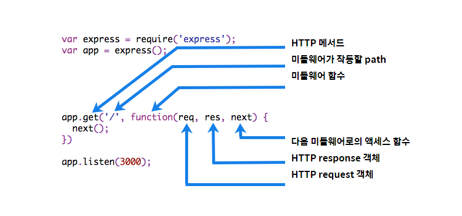

# Section40 : 미들웨어: Express의 키(Key)

## Express 미들웨어 개요

**미들웨어 함수** 는 **req(요청)** 객체, **res(응답)** 객체, 그리고 어플리케이션 **요청-응답 사이클** 도중 그 **다음의 미들웨어 함수** 에 대한 엑세스 권한을 갖는 함수이다.  
**미들웨어** 란 간단하게 말하면 클라이언트에게 요청이 오고 그 요청을 보내기 위해 응답하려는 **중간(미들)에 목적에 맞게 처리를 하는, 말하자면 거쳐가는 함수들** 이라고 보면 된다.  
예를 들어 요청-응답 도중에 시간을 콘솔 창에 남기고 싶으면 미들웨어 함수를 중간에 넣어서 표시를 한 뒤에 계속해서 다음 미들웨어들을 처리할 수 있도록 하는 것이다.  
다음 미들웨어 함수에 대한 엑세스는 **next함수** 를 이용해서 **다음 미들웨어로 현재 요청을 넘길 수 있다.**  
next를 통해 미들웨어는 **순차적으로 처리** 된다.  
다음 그림에 미들웨어 함수 호출의 요소가 표시되어 있다.



```js
app.use(logger("dev"));
app.use(bodyParser.json());
app.use(bodyParser.urlencoded({ extended: false }));
app.use(cookieParser());
app.use(express.static(path.join(__dirname, "public")));

app.use("/", function (req, res, next) {
  console.log("only root");
  next();
});

app.use("/", index);
app.use("/users", users);
app.use("/cars", cars);
```

**app.use** 안에 있는 모든 함수들은 **미들웨어** 이며 요청이 올때마다 이 미들웨어를 거치며 클라이언트에게 응답하게 된다.  
이 미들웨어들은 페이지를 렌더링할 때 사용자 인증을 앞서 거친 후에 렌더링하고 싶을 때 사용자 인증 미들웨어를 작성하고 앞에 삽입하게 되면 편리하다.  
혹은 로그를 먼저 남기고 싶을때도 로그를 남기는 미들웨어를 작성하고 앞서 삽입하면 편리하다.  
미들웨어의 특징을 간략히 정리하면 다음과 같다.

- 모든 코드를 실행
- 다음 미들웨어 호출(순차적으로 실행)
- res, req 객체 변경 가능
- 요청-응답 주기를 종료(response methods를 이용)

**다음 미들웨어를 호출한다** 는 의미는 다음 코드를 보면 알 수 있다.

```js
const express = require("express");
const app = express();

const myLogger = function (req, res, next) {
  console.log("LOGGED");
  next();
};

app.use(myLogger);

app.get("/", function (req, res) {
  res.send("Hello World!");
});

app.listen(3000);
```

클라이언트가 루트 경로(http://localhost:3000)로 요청을 보냈을 때 myLogger를 먼저 거치고 myLogger는 다음 미들웨어 호출 함수(next())를 지정하여 res.send('Hello World!') 코드가 담긴 미들웨어로 넘어가게 된다는 의미이다.  
**res, req 객체 변경 가능** 이라는 의미는 다음 코드를 보면 알 수 있다.

```js
const express = require("express");
const app = express();

const requestTime = function (req, res, next) {
  req.requestTime = Date.now();
  next();
};

app.use(requestTime);

app.get("/", function (req, res) {
  const responseText = "Hello World!";
  responseText += "Requested at: " + req.requestTime + "";
  res.send(responseText);
});

app.listen(3000);
```

requestTime 미들웨어는 req객체 안에 requestTime 라는 프로퍼티를 만들었고 다음 미들웨어에서 프로퍼티 값을 가져올 수 있다.  
**요청-응답 주기를 종료(res methods)** 한다는 의미는 앞서 배웠던 response의 method를 이용하여 클라이언트에게 응답을 전송한다는 의미이다. (응답 전송시 종료)  
위의 코드는 res.send(responseText) 가 주기를 종료한다는 의미이다.

### 미들웨어 유형

express는 다음과 같은 middleware 유형이 존재한다.

1. 어플리케이션 레벨 미들웨어  
   app.use() 및 app.METHOD() 함수 (method: get, post.. 등)을 이용해 app 오브젝트의 인스턴스에 바인드 시킨다.  
   **미들웨어를 어플리케이션 영역에서 지정한 path대로 처리 가능** 하게 하도록 한다.

2. 라우터 레벨 미들웨어  
   라우터 레벨 미들웨어는 **express.Router() 인스턴스에 바인드** 된다는 점을 제외하면 어플리케이션 레벨 미들웨어와 동일한 방식으로 작동한다.  
   Router 객체를 이용해 router.use() 및 router.METHOD() 를 사용하여 **라우터 레벨 미들웨어를 로드** 할 수 있다.  
   라우터 객체는 그 자체가 미들웨어처럼 움직이므로 app.use()의 인수(argument)로 사용될 수 있고 또한 다른 router의 use() 메서드에서 사용될 수 있다.  
   const router = express.Router()로 Router 객체를 생성한 뒤에 app.use()를 사용해 마운트 시켜야지만 사용가능하다.  
   router를 사용하는 이유는 특정 root url을 기점으로 **기능이나 로직별로 라우팅을 나눠서 관리** 할 수 있기 때문이다.

3. 에러 핸들링 미들웨어  
   에러 핸들링을 하는 미들웨어는 4개의 인자를 사용해서 정의하도록 한다.  
   (err, req, res, next)  
   단순히 에러 핸들링 미들웨어는 에러를 다루기 위한 미들웨어이다.

4. 서드 파티 미들웨어  
   기능적으로 express app에 미들웨어를 추가하기 위해 서드 파티 미들웨어 사용을 권고한다.  
   Node.js 모듈을 사용하고 싶다면 application 레벨이든 router 레벨이든 로드해서 사용하면 된다.

## 모건-로거(Morgan-Logger) 미들웨어 사용하기

HTTP 요청을 터미널에 로그로 남겨 준다.  
디버깅 할 때 매우 유용하기 때문에 앱을 개발할 때 많이 이용한다.

```js
// Morgan middleware
const express = require("express");
const app = express();
const morgan = require("morgan");

// 미들웨어로 사용하려면 app.use를 이용해야 한다.
// app.use는 모든 요청에 코드를 실행하게 된다.
app.use(morgan("tiny"));

app.get("/", (req, res) => {
  res.send("HOME PAGE!");
});

app.get("/dogs", (req, res) => {
  res.send("WOOF WOOF!");
});

app.listen(3000, () => {
  console.log("App is running on localhost:3000");
});
```

GET /dogs 200 10 - 1.890 ms 이런 식으로 Morgan이 요청 정보를 로그에 기록한다.
GET 요청으로 /dogs url로 이동하였고 200 상태코드(성공)을 의미한다.

## 미들웨어 정의하기

```js
const express = require("express");
const app = express();
const morgan = require("morgan");

app.use(morgan("tiny"));
app.use((req, res, next) => {
  console.log("THIS IS MY FIRST MIDDLEWARE!!");
  next();
  console.log("THIS IS MY FIRST MIDDLEWARE!!-AFTER CALLING NEXT()");
});

app.use((req, res, next) => {
  console.log("THIS IS MY SECOND MIDDLEWARE!!");
  next();
});

app.get("/", (req, res) => {
  res.send("HOME PAGE!");
});

app.get("/dogs", (req, res) => {
  res.send("WOOF WOOF!");
});

app.listen(3000, () => {
  console.log("App is running on localhost:3000");
});
```

console.log를 출력하는 첫번째 미들웨어에서 next() 메서드가 없다면 'THIS IS MY SECOND MIDDLEWARE!!' 는 출력되지 않는다.  
next() 메서드를 사용해야 다음 미들웨어를 실행한다.

위의 예제 코드에서 출력되는 순서는  
"THIS IS MY FIRST MIDDLEWARE!!"  
"THIS IS MY SECOND MIDDLEWARE!!"  
"THIS IS MY FIRST MIDDLEWARE!!-AFTER CALLING NEXT()"  
Morgan()  
순이다.  
FIRST 가 출력되고 next()가 실행되 SECOND 가 출력되고 그 다음 AFTER 가 출력되고 Morgan이 마지막으로 출력된다. Morgan 미들웨어의 특성상 마지막으로 출력된다.

## 미들웨어 더 알아보기

```js
const express = require("express");
const app = express();
const morgan = require("morgan");

app.use(morgan("tiny"));
app.use((req, res, next) => {
  console.log(req.method.toUpperCase(), req.path);
  next();
});
// 요청 동사와 요청 경로를 로그에 출력해주는 미들웨어를 만들었다.
```

## 404 경로 설정

```js
...
app.get('/dogs', (req, res) => {
  console.log(`REQUEST DATE: ${req.requestTime}`)
  res.send('WOOF WOOF!')
})

app.use((req, res) => {
  res.send('NOT FOUND!')
})
...
```

app.use에 경로나 문자열을 설정할 수도 있다. 첫 번째 미들웨어는 /dogs 경로에 어떤 메서드로 요청을 보내도 'WOOF WOOF!' 가 출력된다. 두 번째 미들웨어는 보통 맨 마지막에 작성하는데 위의 라우터들이 경로를 찾고, 경로를 못 찾았을 경우 실행된다.

## 미들웨어 패스워드 설정 데모

```js
...
app.use((req, res, next) => {
  const { password } = req.query;
  // 요청의 query에서 password 값을 가져온다.
  if (password === 'chickennugget') {
    next();
    // password가 chickennugget이면 다음 미들웨어를 실행한다.
  }
  res.send('SORRY YOU NEED A PASSWORD!!!')
  // password가 다르면 문구룰 출력하거나 리다이렉트로 전 페이지를 띄울 수 있다.
})
```

## 특정 경로 보호하기

위의 예제는 모든 라우터에서 패스워드를 요구하고 있다. 이걸 한 개의 라우트 경로에만 패스워드를 요구하도록 수정할 수 있다.

```js
...
const verifyPassword = (req, res, next) => {
  const { password } = req.query;
  if (password === 'chickennugget') {
    next();
  }
  res.send('SORRY YOU NEED A PASSWORD!!!')
}
// req.query에 있는 password의 값이 chickennugget 이면 next() 를,
// 값이 다르다면 send() 메서드를 실행하는 verifyPassword 함수를 생성한다.
...
app.get('/secret', verifyPassword, (req, res) => {
  res.send('MY SECRET IS: Sometimes I weer headphones')
})
// /secret 경로로 이동하면 verifyPassword 함수를 실행한다.
// if문이 true인 경우 next()를 실행해 'MY SECRET IS:...'이 실행되고,
// false인 경우 'SORRY YOU ...' 문구가 출력된다.
```
